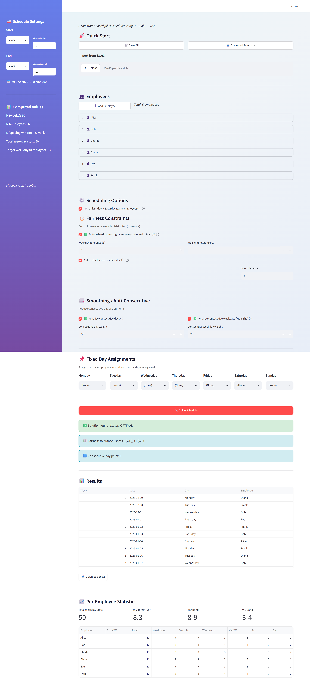

# On-Call (Piket) Scheduler

A constraint-optimization tool that builds **fair** on-call rosters: feed it a team,
their constraints, and a date range, and it assigns exactly one person per day while
balancing the load across weekdays, weekends, Saturdays and Sundays — solved with
Google OR-Tools CP-SAT and driven from a small Streamlit UI.

> *"Piket"* is Dutch for on-call / picket duty — the original use case was a rotating
> engineering on-call rota.

## Screenshot



*Demo run (placeholder names): the solver returns an **OPTIMAL** assignment with each
person's weekday duties balanced to within 1, respecting per-person forbidden days.*

## What it does

Hand-building an on-call schedule is deceptively hard: everyone should do a roughly
equal share, but people have days they can't work, vacations, and some carry a heavier
weekend load — and "fair" has to hold across several axes at once (total duties,
weekday vs weekend, Saturdays vs Sundays). This tool models all of that as a single
optimization problem and solves it to a provably balanced assignment in seconds.

You enter employees and their constraints (or upload an Excel sheet), pick a date
range, and the app produces a day-by-day roster plus per-person statistics, exportable
back to Excel. There's also a small "random duty picker" wheel for ad-hoc assignments.

## Tech stack

- **Solver:** Google **OR-Tools CP-SAT** (constraint / integer optimization)
- **UI:** Streamlit
- **Data:** pandas + openpyxl (Excel import/export)
- **No backend, no API keys** — it runs fully locally on tabular input.

## The optimization model

The core lives in [`solver.py`](solver.py). Each day in the range gets a boolean
decision variable per employee, `assign[e, d] ∈ {0,1}`, and the model is:

**Decision variables**
- `assign[e, d]` — employee `e` is on duty on date `d`.
- Helper integer vars for per-employee weekday / weekend / Saturday / Sunday counts.

**Hard constraints**
1. **Exactly one** employee on duty per day.
2. **Fixed recurring assignments** — e.g. "Mondays are Person A" — honoured every week
   (and automatically freed when that person is on vacation).
3. **Availability** — forbidden weekdays and vacation ranges are never assigned.
4. **Pattern consistency** — an employee draws from at most 2 distinct Mon–Thu weekdays
   (3 over long horizons), so duties don't scatter randomly across the week.
5. **Extra-weekend quota** — a designated heavy-weekend person works at least *H* weekends.
6. **Optional Friday→Saturday linking** — whoever takes a Friday also takes the Saturday.
7. **Fairness spread caps** — max−min of weekday, weekend, Saturday, Sunday and total
   duties is bounded by a tolerance, with an anti-correlation rule (high weekday share ⇒
   low weekend share) that pins *total* spread to ≤ 1.

**Soft objective (weighted, minimized)**
- Minimize the weekday/weekend duty **spread** (highest weight).
- Minimize each person's **deviation** from their fair target share.
- Balance **Saturdays vs Sundays** per person.
- Penalize **consecutive-day** duties.
- Penalize **weekend clustering** within a sliding multi-week window.

**Auto-relax for feasibility.** The solver tries tolerance 1, 2, … up to a max; if still
infeasible it releases vacations (longest first) and retries, so it degrades gracefully
instead of just failing.

## Setup

```bash
pip install -r requirements.txt
streamlit run app.py
```

Then open the local URL Streamlit prints. Add employees and their constraints in the
sidebar, or use **Download Template** to get an Excel sheet, fill it in, and upload it —
then generate the schedule.

## Example

**Input** — 8 engineers over a quarter, e.g.:

| Employee | Can't work | Vacation | Notes |
|----------|------------|----------|-------|
| Alice    | —          | —        | Mondays fixed to Alice |
| Charlie  | Mondays    | —        | |
| Diana    | Fridays    | —        | |
| Frank    | weekends   | Aug 1–14 | |
| …        | …          | …        | one person flagged "extra weekend" |

**Output** — one fair assignment per day, plus a stats table:

| Date       | Day | On duty |
|------------|-----|---------|
| 2025-07-01 | Tue | Bob     |
| 2025-07-02 | Wed | Eve     |
| 2025-07-05 | Sat | Grace   |
| …          | …   | …       |

| Employee | Total | Weekday | Weekend | Sat | Sun |
|----------|-------|---------|---------|-----|-----|
| Alice    | 14    | 10      | 4       | 2   | 2   |
| Bob      | 14    | 9       | 5       | 2   | 3   |
| …        | …     | …       | …       | …   | …   |

— totals balanced to within the configured tolerance across every axis.

## Status

Personal / portfolio project. Built to automate a real engineering on-call rota;
sample names in the app are placeholders (Alice, Bob, …).

## License

MIT — see [LICENSE](LICENSE).
